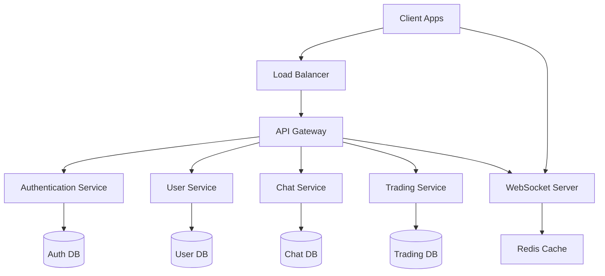
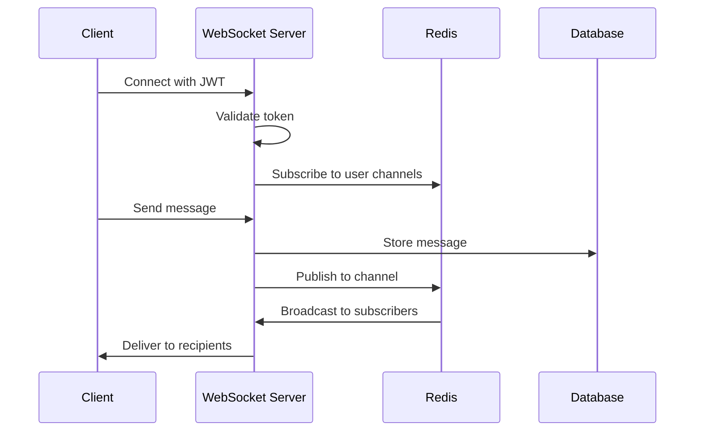
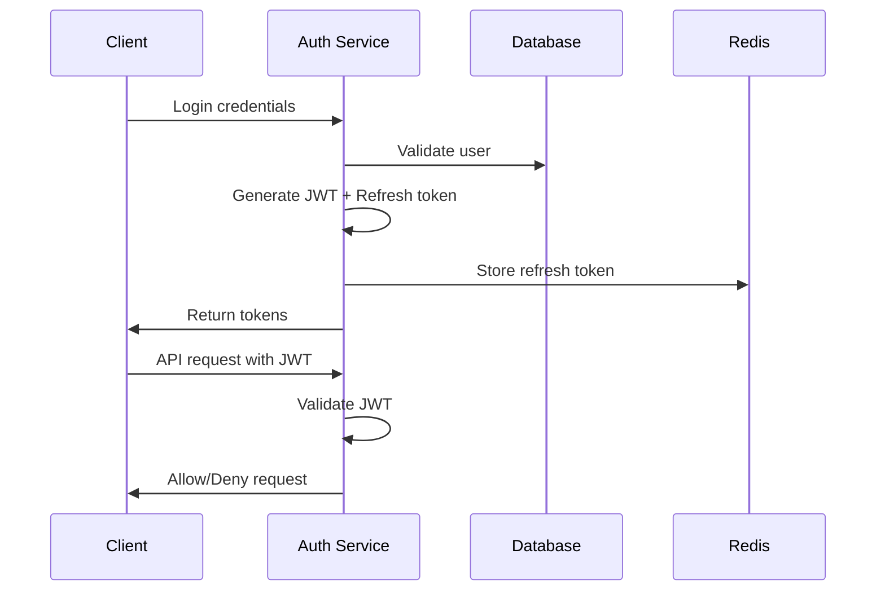
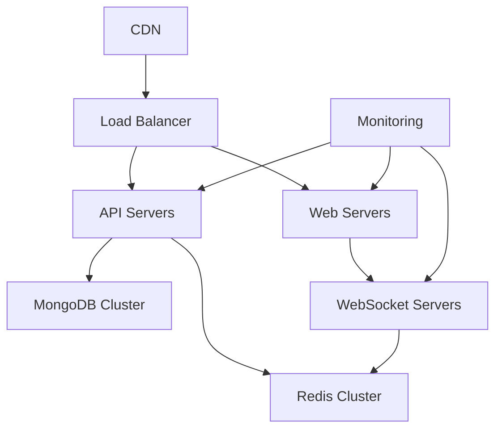
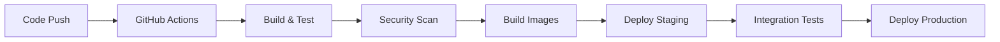
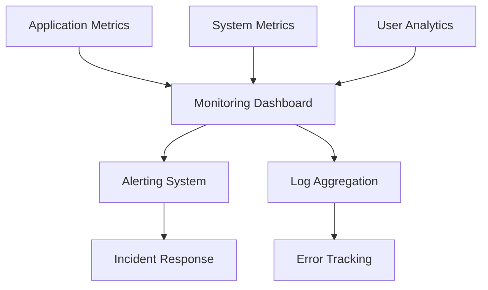
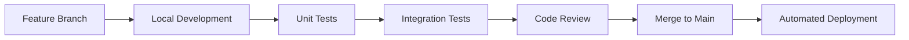

# Potato Chat Architecture Documentation

## 🏗️ System Overview

Potato Chat is a cross-platform social finance application built with a modern microservices architecture. The system consists of multiple client applications, a centralized backend API, and supporting infrastructure.

## 📐 Architecture Principles

### Design Philosophy
- **Cross-platform Consistency**: Unified user experience across all platforms
- **Scalability**: Horizontal scaling capabilities for high load
- **Security**: Security-first approach with multiple layers of protection
- **Performance**: Optimized for speed and responsiveness
- **Maintainability**: Clean code architecture for easy maintenance

### Architectural Patterns
- **Microservices**: Modular backend services
- **Event-Driven**: Real-time updates via WebSocket events
- **RESTful API**: Standard HTTP API for client-server communication
- **Component-Based**: Reusable UI components across platforms
- **State Management**: Centralized state management in clients

## 🎯 System Components

### Client Applications

#### 1. Desktop Application (Electron + React)
```
PotatoChatDesktop/
├── main.js                    # Electron main process
├── preload.js                 # Security bridge
└── potato-chat-desktop-frontend/
    ├── src/
    │   ├── App.jsx            # Main application
    │   ├── components/        # Reusable components
    │   ├── services/          # API services
    │   └── utils/             # Utility functions
    └── dist/                  # Built application
```

**Technology Stack:**
- **Runtime**: Electron 28.x
- **Frontend**: React 18 + TypeScript
- **Styling**: Tailwind CSS + shadcn/ui
- **Build**: Vite + electron-builder
- **State**: React Context + Hooks

**Key Features:**
- Native desktop integration
- System tray support
- Auto-updater capability
- Offline functionality
- Multi-window support

#### 2. Web Application (React)
```
potato-chat-web/
├── src/
│   ├── App.jsx               # Main application
│   ├── components/           # UI components
│   ├── services/             # API services
│   ├── hooks/                # Custom hooks
│   └── lib/                  # Utilities
├── public/                   # Static assets
└── dist/                     # Built application
```

**Technology Stack:**
- **Framework**: React 18 + TypeScript
- **Styling**: Tailwind CSS + shadcn/ui
- **Build**: Vite
- **PWA**: Service Worker + Manifest
- **State**: Zustand + React Query

**Key Features:**
- Progressive Web App (PWA)
- Responsive design
- Offline caching
- Push notifications
- Mobile-optimized UI

#### 3. Android Application (Native Java + React Native)
```
PotatoChatMobile/
├── android/                  # Native Android code
│   ├── app/src/main/java/    # Java source code
│   ├── app/src/main/res/     # Resources
│   └── build.gradle          # Build configuration
├── src/                      # React Native code
│   ├── screens/              # Screen components
│   ├── navigation/           # Navigation setup
│   ├── services/             # API services
│   └── utils/                # Utilities
└── package.json              # Dependencies
```

**Technology Stack:**
- **Native**: Java + Android SDK
- **Hybrid**: React Native + TypeScript
- **UI**: Material Design Components
- **Build**: Gradle + Android Studio
- **State**: Redux Toolkit

**Key Features:**
- Native performance
- Material Design UI
- Background services
- Push notifications
- Biometric authentication

#### 4. iOS Application (React Native)
```
PotatoChatIOS/
├── ios/                      # Native iOS code
│   ├── PotatoChatIOS/        # Xcode project
│   └── Podfile               # CocoaPods dependencies
├── src/                      # React Native code
│   ├── screens/              # Screen components
│   ├── navigation/           # Navigation setup
│   ├── store/                # State management
│   └── services/             # API services
└── package.json              # Dependencies
```

**Technology Stack:**
- **Framework**: React Native + TypeScript
- **Navigation**: React Navigation
- **UI**: iOS Design Guidelines
- **Build**: Xcode + Metro
- **State**: Redux Toolkit

**Key Features:**
- Native iOS performance
- iOS design compliance
- Face ID / Touch ID
- Background app refresh
- iOS-specific integrations

### Backend Services

#### 1. Admin Dashboard (React + Node.js)
```
PotatoChatAdmin/
├── frontend/                 # React admin interface
│   ├── src/
│   │   ├── pages/            # Admin pages
│   │   ├── components/       # UI components
│   │   └── services/         # API services
│   └── dist/                 # Built frontend
└── backend/                  # Node.js API server
    ├── src/
    │   ├── controllers/      # Route controllers
    │   ├── models/           # Database models
    │   ├── routes/           # API routes
    │   ├── middleware/       # Express middleware
    │   └── services/         # Business logic
    └── package.json          # Dependencies
```

**Technology Stack:**
- **Frontend**: React 18 + TypeScript + Tailwind CSS
- **Backend**: Node.js + Express + TypeScript
- **Database**: MongoDB + Mongoose
- **Authentication**: JWT + Refresh Tokens
- **Real-time**: Socket.IO

**Key Features:**
- User management
- Content moderation
- Analytics dashboard
- System monitoring
- Configuration management

## 🔄 Data Flow Architecture

### Client-Server Communication



### Real-time Communication Flow



## 🗄️ Database Design

### MongoDB Collections

#### Users Collection
```javascript
{
  _id: ObjectId,
  username: String,
  email: String,
  passwordHash: String,
  profile: {
    firstName: String,
    lastName: String,
    avatar: String,
    bio: String
  },
  settings: {
    theme: String,
    notifications: Boolean,
    privacy: Object
  },
  createdAt: Date,
  updatedAt: Date
}
```

#### Messages Collection
```javascript
{
  _id: ObjectId,
  roomId: ObjectId,
  senderId: ObjectId,
  content: String,
  type: String, // text, image, file
  metadata: Object,
  timestamp: Date,
  edited: Boolean,
  deleted: Boolean
}
```

#### Trading Collection
```javascript
{
  _id: ObjectId,
  userId: ObjectId,
  symbol: String,
  type: String, // buy, sell
  quantity: Number,
  price: Number,
  status: String, // pending, executed, cancelled
  timestamp: Date
}
```

### Redis Cache Structure

```
user:sessions:{userId} -> Set of session tokens
user:online:{userId} -> Online status
room:members:{roomId} -> Set of user IDs
market:data:{symbol} -> Latest market data
```

## 🔐 Security Architecture

### Authentication Flow



### Security Layers

1. **Transport Security**
   - HTTPS/TLS 1.3 for all communications
   - WSS (WebSocket Secure) for real-time data
   - Certificate pinning in mobile apps

2. **Authentication & Authorization**
   - JWT tokens with short expiration
   - Refresh token rotation
   - Role-based access control (RBAC)
   - Multi-factor authentication (MFA)

3. **Data Protection**
   - Encryption at rest (AES-256)
   - Encryption in transit (TLS 1.3)
   - Password hashing (bcrypt)
   - Sensitive data masking

4. **API Security**
   - Rate limiting per user/IP
   - Input validation and sanitization
   - SQL injection prevention
   - CORS configuration
   - Security headers (HSTS, CSP, etc.)

## 🚀 Deployment Architecture

### Production Environment



### Container Architecture

```yaml
# docker-compose.yml structure
services:
  web:
    image: potato-chat-web
    ports: ["80:80"]
    
  api:
    image: potato-chat-api
    ports: ["5000:5000"]
    environment:
      - NODE_ENV=production
      - MONGODB_URI=mongodb://mongo:27017/potatochat
    
  websocket:
    image: potato-chat-websocket
    ports: ["8080:8080"]
    
  mongo:
    image: mongo:5.0
    volumes: ["mongo_data:/data/db"]
    
  redis:
    image: redis:7.0
    volumes: ["redis_data:/data"]
```

### CI/CD Pipeline



## 📊 Performance Architecture

### Caching Strategy

1. **Client-Side Caching**
   - Browser cache for static assets
   - LocalStorage for user preferences
   - IndexedDB for offline data
   - Service Worker for PWA caching

2. **Server-Side Caching**
   - Redis for session data
   - Redis for frequently accessed data
   - CDN for static assets
   - Database query result caching

3. **Real-time Optimization**
   - WebSocket connection pooling
   - Message queuing with Redis
   - Horizontal scaling of WebSocket servers
   - Load balancing for real-time connections

### Monitoring & Observability



**Key Metrics:**
- Response time and throughput
- Error rates and success rates
- User engagement metrics
- System resource utilization
- Real-time connection health

## 🔧 Development Architecture

### Development Workflow



### Code Organization

```
potato-chat/
├── shared/                   # Shared utilities and types
│   ├── types/               # TypeScript type definitions
│   ├── utils/               # Common utility functions
│   └── constants/           # Shared constants
├── packages/                # Reusable packages
│   ├── ui-components/       # Shared UI components
│   ├── api-client/          # API client library
│   └── websocket-client/    # WebSocket client library
└── apps/                    # Application-specific code
    ├── desktop/
    ├── web/
    ├── mobile/
    └── admin/
```

## 🎯 Scalability Considerations

### Horizontal Scaling

1. **Stateless Services**
   - API servers are stateless
   - Session data stored in Redis
   - Load balancing across multiple instances

2. **Database Scaling**
   - MongoDB sharding for large datasets
   - Read replicas for read-heavy operations
   - Connection pooling and optimization

3. **Real-time Scaling**
   - WebSocket server clustering
   - Redis pub/sub for message distribution
   - Sticky sessions for WebSocket connections

### Performance Optimization

1. **Frontend Optimization**
   - Code splitting and lazy loading
   - Image optimization and compression
   - Bundle size optimization
   - Progressive loading strategies

2. **Backend Optimization**
   - Database indexing strategy
   - Query optimization
   - Caching layers
   - Asynchronous processing

3. **Network Optimization**
   - CDN for global content delivery
   - Compression (gzip/brotli)
   - HTTP/2 and HTTP/3 support
   - Connection keep-alive

## 📈 Future Architecture Considerations

### Planned Enhancements

1. **Microservices Migration**
   - Split monolithic API into microservices
   - Service mesh implementation
   - Independent scaling and deployment

2. **Advanced Analytics**
   - Real-time analytics pipeline
   - Machine learning integration
   - Predictive analytics for trading

3. **Global Distribution**
   - Multi-region deployment
   - Edge computing integration
   - Geo-distributed databases

4. **Enhanced Security**
   - Zero-trust architecture
   - Advanced threat detection
   - Compliance automation

---

This architecture documentation provides a comprehensive overview of the Potato Chat system design. For specific implementation details, refer to the individual component documentation in their respective directories.

